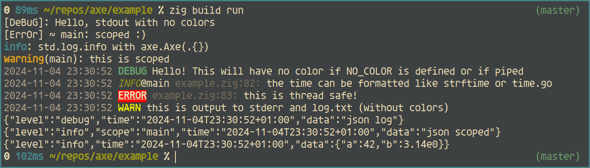

# Axe 🪓

A fully customizable logging library for the Zig programming language.



## Features

- Drop-in replacement for `std.Options.LogFn`
- Minimal (less than 1000 LOC)
- Extremely fast performance with intensive use of comptime
- Parallel file logging with support for stderr & custom writers
- Full custom format support with sane defaults & [JSON](https://github.com/ratakor/axe/blob/master/example/example/zig#L93) support
- Source location support with `axe.logAt(@src(), ...)`
- Built-in time support with [zeit](https://github.com/rockorager/zeit)
- Built-in colors support
  - Automatic tty detection
  - Windows support
  - NO\_COLOR & CLICOLOR\_FORCE environment variables support
- Built-in thread safety with multiple mutex interface available

## Installation

Add it to an existing project with this command:
```sh
zig fetch --save git+https://github.com/Ratakor/axe
```
Then add the module to build.zig.
```zig
const axe = b.dependency("axe", .{}).module("axe");
exe.root_module.addImport("axe", axe);
```

# Usage

```zig
const std = @import("std");
const axe = @import("axe").Axe(.{
    // Config goes here.
    .mutex = .{ .function = .progress_stderr },
});

// Replace the default logFn.
pub const std_options: std.Options = .{
    .logFn = axe.log,
};

pub fn main() !void {
    const allocator = std.heap.page_allocator;
    try axe.init(allocator, null, null);
    defer axe.deinit(allocator);

    std.log.debug("Hello {s}!", .{ "World" });
    axe.infoAt(@src(), "Some info with source location", .{});
}
```

Check [example.zig](example/example.zig) for more!

# Docs

See the [API Documentation](https://ratakor.github.io/axe).
